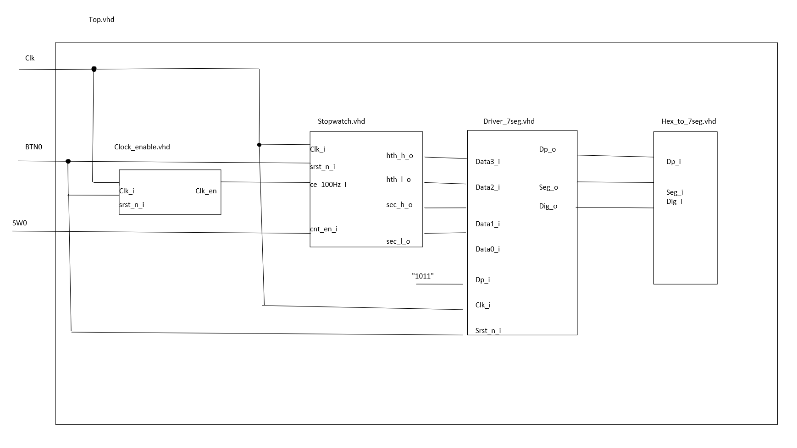

# Stopwatch.vhd schema

# top.vhdl schema

# testbench

**! please note**: that timing in simulation is dilated due to limited simulation time and memory on online simulator.

## testbench reset and enable

## testbench counting

