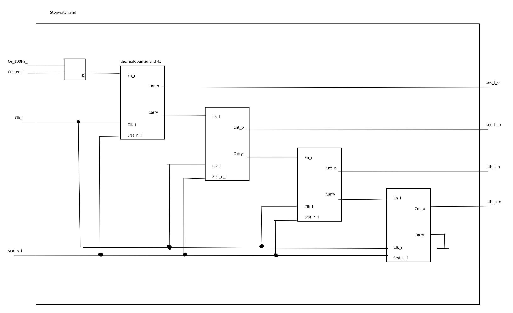
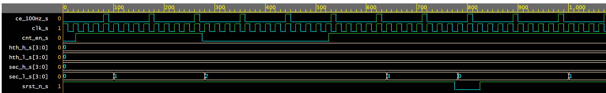
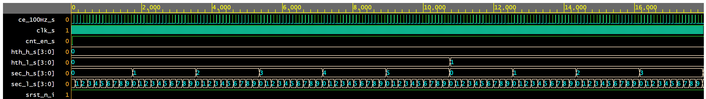
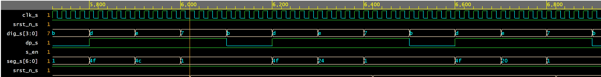

# Stopwatch.vhd schema



# stopwatch.vhdl 

```javascript

library ieee;
use ieee.std_logic_1164.all;
use ieee.numeric_std.all;

entity stopwatch is
port(

	clk_i : in std_logic := '0';
    srst_n_i : in std_logic:= '1';
	ce_100Hz_i : in std_logic := '0';
    cnt_en_i : in std_logic := '0';
    sec_h_o : out std_logic_vector(3 downto 0) := (others => '0');
	sec_l_o : out std_logic_vector(3 downto 0) := (others => '0');
	hth_h_o : out std_logic_vector(3 downto 0) := (others => '0');
	hth_l_o : out std_logic_vector(3 downto 0) := (others => '0'));

end entity stopwatch;

architecture Behavioral of stopwatch is
signal en_dc0_s, en_dc1_s,en_dc2_s, en_dc3_s, en_dc4_s, en_100Hz :std_logic := '0';
    
begin

decimalCounter0 : entity work.decimalCounter
	generic map (
    				pwm => 9
							)
	port map (
		 clk_i => clk_i,
    srst_n_i => srst_n_i,
    en_i => en_dc0_s,
    cnt_o => sec_l_o,
    carry => en_dc1_s
	);
    
decimalCounter1 : entity work.decimalCounter
    generic map (
                        pwm => 9
                                )
	port map (
		 clk_i => clk_i,
    srst_n_i => srst_n_i,
    en_i => en_dc1_s,
    cnt_o => sec_h_o,
    carry => en_dc2_s
	);
    
decimalCounter2 : entity work.decimalCounter
	generic map (
    				pwm => 9
							)
	port map (
		 clk_i => clk_i,
    srst_n_i => srst_n_i,
    en_i => en_dc2_s,
    cnt_o => hth_l_o,
    carry => en_dc3_s
	);
    
decimalCounter3 : entity work.decimalCounter
	generic map (
    				pwm => 5
							)
	port map (
		 clk_i => clk_i,
    srst_n_i => srst_n_i,
    en_i => en_dc3_s,
    cnt_o => hth_h_o,
    carry => en_dc4_s
	);
   
  A : process(clk_i)
   begin
   
   if rising_edge(clk_i) then  -- Rising clock edge
     if srst_n_i = '0' then  -- Synchronous reset (active low)
     en_dc0_s <= '0';  
     else
     	en_dc0_s <= ce_100Hz_i and cnt_en_i;     
     end if;
   end if;
  
   
   end process A;

end architecture Behavioral;

```

# top.vhdl 

```javascript
------------------------------------------------------------------------
--
-- top file for 
-- Xilinx XC2C256-TQ144 CPLD, ISE Design Suite 14.7
--
-- Copyright (g) 2019-2020 Tomas Fryza
-- Dept. of Radio Electronics, Brno University of Technology, Czechia
-- This work is licensed under the terms of the MIT license.
--
------------------------------------------------------------------------

library ieee;
use ieee.std_logic_1164.all;
use ieee.std_logic_unsigned.all;    -- Provides unsigned numerical computation

------------------------------------------------------------------------
-- Entity declaration for display driver
------------------------------------------------------------------------
entity stopwatchTop is
port (
    clk_i    	: in  std_logic;
    BTN0_i 		: in  std_logic;   -- Synchronous reset (active low);
    SW0_i 		: in std_logic;    -- stopwatch enable
    disp_seg_o	: out std_logic_vector(7-1 downto 0);
  	disp_dig_o	: out std_logic_vector(4-1 downto 0);
    disp_dp_o	: out std_logic
);
end entity stopwatchTop;

------------------------------------------------------------------------
-- Architecture declaration for display driver
------------------------------------------------------------------------
architecture Behavioral of stopwatchTop is
    signal s_en, srst_n_s, cnt_en_s, dp_s  : std_logic := '0';
    signal sec_h_s, sec_l_s,hth_h_s, hth_l_s, dig_s : std_logic_vector(4-1 downto 0) := (others => '0');
    signal seg_s : std_logic_vector(6 downto 0) := (others => '0');
begin

disp_seg_o <= seg_s;
disp_dig_o <= dig_s;
disp_dp_o <= dp_s;
srst_n_s <= BTN0_i;
s_en <= SW0_i;

    --------------------------------------------------------------------
    -- Sub-block of clock_enable entity. Create s_en signal.
    CLK_EN_0 : entity work.clock_enable
			generic map (
								g_NPERIOD => x"0028"
							)
	port map (
		 clk_i   => clk_i,   -- 10 kHz
		 srst_n_i => srst_n_s,    -- Synchronous reset
		 clock_enable_o   => cnt_en_s   -- Output bits
	);


    --------------------------------------------------------------------
    -- Sub-block of stopwatch entity
    StopWatch: entity work.stopwatch
        port map (
                  clk_i => clk_i,
                  srst_n_i => srst_n_s,
                  ce_100Hz_i => cnt_en_s,
                  cnt_en_i => s_en,
                  sec_h_o => sec_h_s,
                  sec_l_o => sec_l_s,
                  hth_h_o => hth_h_s,
                  hth_l_o => hth_l_s);
                  
	--------------------------------------------------------------------
    -- Sub-block of 7 segment driver entity
    Driver7Seg: entity work.driver_7seg
        port map (
                  clk_i   	=> clk_i,
                  srst_n_i 	=> srst_n_s,
                  data0_i  	=> sec_l_s,
                  data1_i  	=> sec_h_s,
                  data2_i  	=> hth_l_s,
                  data3_i   => hth_h_s,
                  dp_i      => "1011",
                  dp_o      => dp_s,
                  seg_o     => seg_s,
                  dig_o     => dig_s);
                  
                  

end architecture Behavioral;
```
# testbench.vhdl 

```javascript

-- Code your testbench here
library IEEE;
use IEEE.std_logic_1164.all;

entity testbench is
-- empty
end testbench; 

architecture tb of testbench is

-- DUT (Device Under Test) component
component stopwatchTop is
port (
    clk_i    	: in  std_logic;
    BTN0_i 		: in  std_logic;   -- Synchronous reset (active low);
    SW0_i 		: in std_logic;    -- stopwatch enable
    disp_seg_o	: out std_logic_vector(7-1 downto 0);
  	disp_dig_o	: out std_logic_vector(4-1 downto 0);
    disp_dp_o	: out std_logic;
    test : out std_logic
);
end component;

 	signal clk_s : std_logic := '0';
    signal s_en, srst_n_s, dp_s  : std_logic := '1';
    signal test_S :std_logic;
    signal dig_s : std_logic_vector(4-1 downto 0);
    signal seg_s : std_logic_vector(6 downto 0);

begin

	-- Connect DUT
  	DUT: stopwatchTop port map(clk_s, srst_n_s, s_en, seg_s, dig_s, dp_s,test_s);
   

    
    CLK_GEN: process
  	begin
      while true loop
        clk_s <= not clk_s;
        wait for 10 ms;
      end loop;
	end process CLK_GEN;
    
end tb;

```

# testbench

**! please note**: that timing in simulation is dilated due to limited simulation time and memory on online simulator.

## testbench reset and enable



## testbench counting



## top testbench


